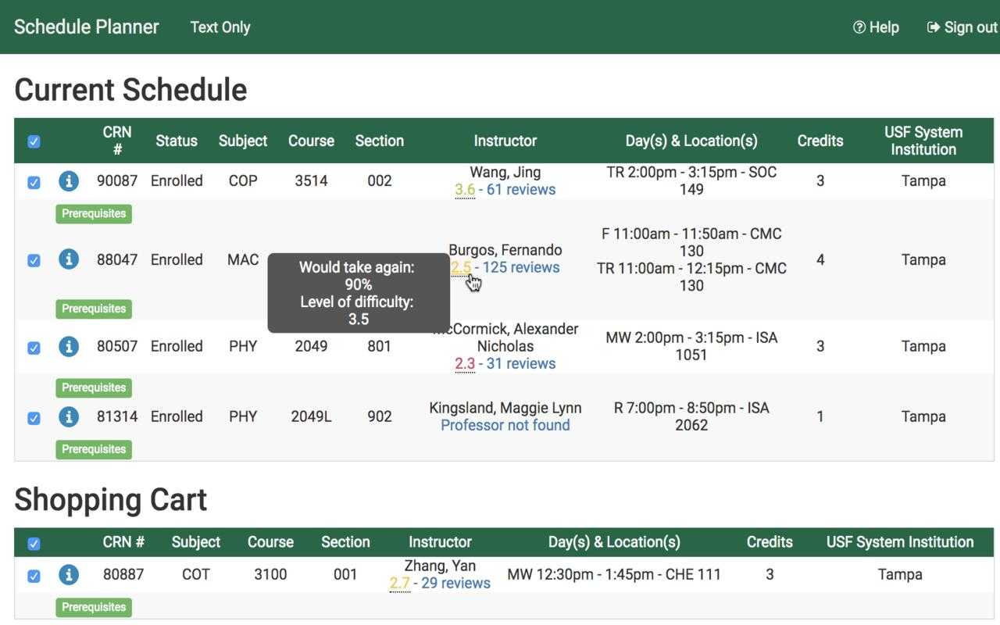

# Rate-My-Bull
A [Rate My Professor chrome extension](https://chrome.google.com/webstore/detail/rate-my-bull/jmibihbbdehdabfanebphnghpeifocfa?hl=en) for USF (University of South Florida) students. Professor scores will show up when students sign up for classes using the USF schedule planner.

Hover over the score to view more information or click on the score to open up the professors profile on Ratemyprofessor.com

